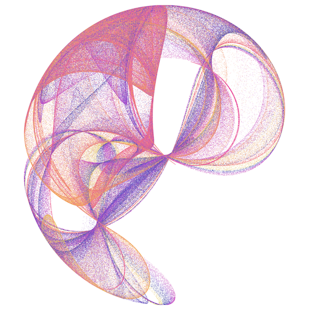
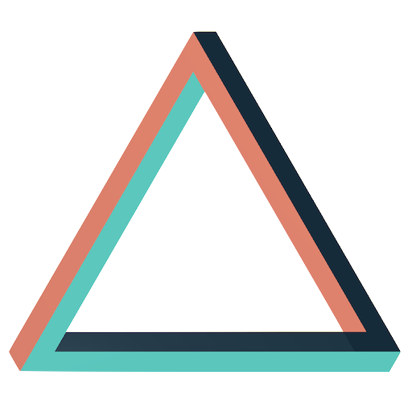
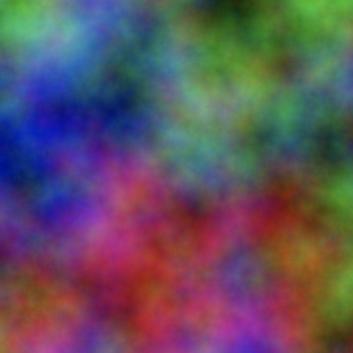
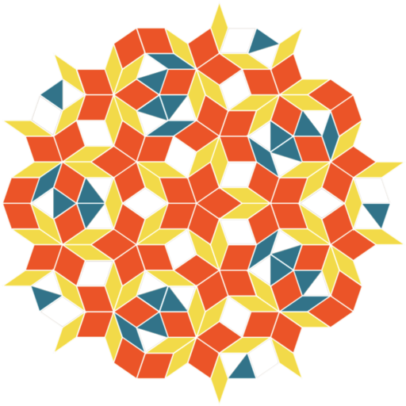
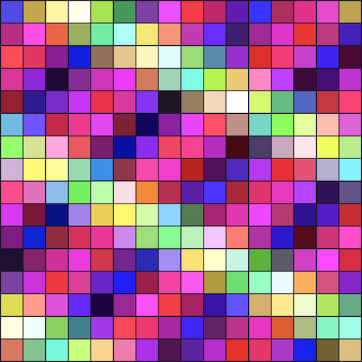

### 👋 Hi there

Currently working on [Dynamic Instrumentation](https://www.datadoghq.com/product/dynamic-instrumentation/) at [Datadog](http://github.com/datadog). Previously: security at [Monzo](http://github.com/monzo), CloudGuru Profiler at [Amazon](https://github.com/amzn).
Public repos here are toy projects, here are some things I've made:

| [][many-worlds] | [][entangled] | [][penrose-triangle] |
|:---:|:---:|:---:|
| [][color-automata] | [][penrose-tiling] | [][256-colors] |

I'm not active on social media at the moment and I don't usually reply to recruiter emails.

:sparkles: :heart: :sparkles:

[color-automata]: https://cimi.io/color-automata
[256-colors]: https://cimi.io/shaders/#/256-colors
[penrose-triangle]: https://cimi.io/
[penrose-tiling]: https://cimi.io/penrose-tiling
[entangled]: https://cimi.io/entangled
[many-worlds]: https://cimi.io/many-worlds

